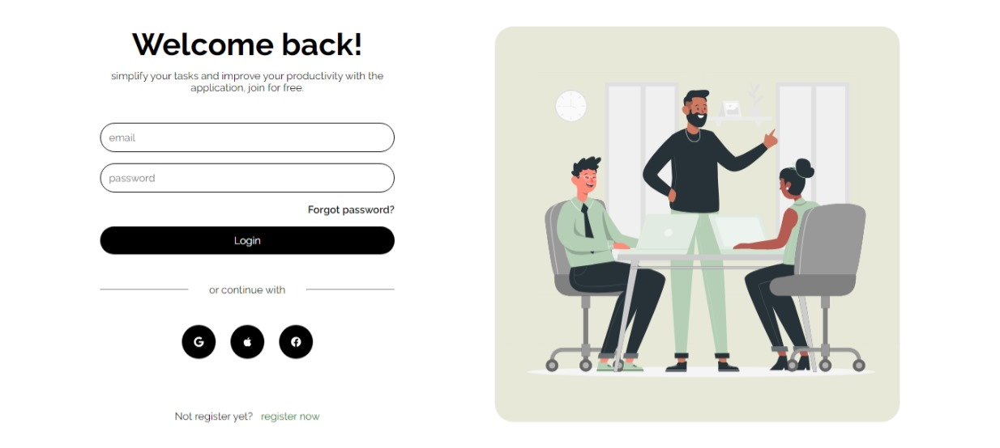
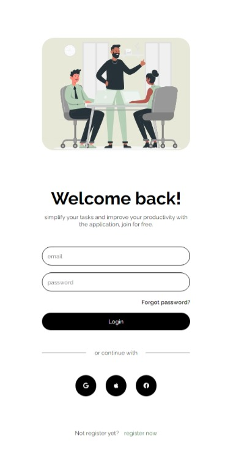

## Práctica de Maquetado con HTML y CSS

**Descripción:** Práctica de maquetado a partir de un diseño web responsive para iniciar sesión utilizando react

**Nota:** El diseño, íconos e imágenes fueron tomados de la web con fines de práctica y aprendizaje.

**Visualización en tamaño Desktop:**

**Visualización en tamaño Movil:** 

